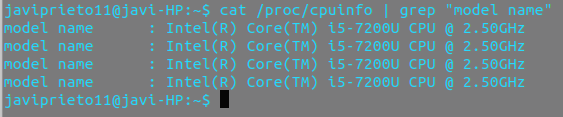
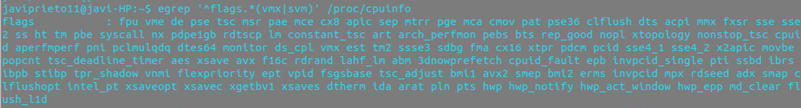

# Ejercicios Tema 1

Ejercicios correspondiente a https://jj.github.io/IV/documentos/temas/Intro_concepto_y_soporte_fisico

## Ejercicio 1
**Consultar en el catálogo de alguna tienda de informática el precio de un ordenador tipo servidor y calcular su coste de amortización a cuatro y siete años.**

Vamos a elegir TS-1277-64G NAS 12 Bahías – AMD Ryzen 7 1700 64GB de RAM con un coste de 4.112,92€

El coste de amortización para equipos para tratamiento de la información es del 25% con un mínimo de cuatro años y un máximo de 8.
Vamos a aplicar una amortización lineal donde las cuotas son constantes y no afecta la depreciación efectiva del inmoviliario. 

De esta forma:

Activo 4.112,92€ - 21% IVA = **3.249,20€**

Para **4 años** se amortiza el 25% anual -> 3.249,20 / 4 = **812,30 €**

Para **8 años** se amortiza el 14,28% anual ->   3.249,20 / 7 = **464,17 €**

## Ejercicio 2
**Usando las tablas de precios de servicios de alojamiento en Internet “clásicos”, es decir, que ofrezcan Virtual Private Servers o servidores físicos, y de proveedores de servicios en la nube, comparar el coste durante un año de un ordenador con un procesador estándar (escogerlo de forma que sea el mismo tipo de procesador en los dos vendedores) y con el resto de las características similares (tamaño de disco duro equivalente a transferencia de disco duro) en el caso de que la infraestructura comprada se usa solo el 1% o el 10% del tiempo.**

Vamos a comparar lo mejor que nos ofrece cada página.

[Enlace a Servicios en la nube](https://www.acens.com/cloud/cloud-servers/?gclid=EAIaIQobChMIxvD-4-C93QIVAud3Ch0a-AN_EAAYAyAAEgIJBPD_BwE)

- Precio 249,90€/mes
- Procesador Intel Xeon 12vCPU
- RAM de 32 GB
- Disco SSD de 360GB
- Transferencia ilimitada

Contabiliza los minutos y es redimensionable cuando se necesite.

Si se usa el **10 %** -> 249,90 * 0,10 = **24.99 al mes.**

Si se usa el **1 %** ->  **2.499 al mes.**

[Enlace al servidor físico](https://www.profesionalhosting.com/servidores-dedicados/servidor-oro-64g-2tb.html#precio)

- Precio 450€/mes
- Procesador Intel Xeon E5-1650v4
- Disco duro 2*2TB
- Dominios ilimitado

## Ejercicio 3
**En general, cualquier ordenador con menos de 5 o 6 años tendrá estos flags. ¿Qué modelo de procesador es? ¿Qué aparece como salida de esa orden? Si usas una máquina virtual, ¿qué resultado da? ¿Y en una Raspberry Pi o, si tienes acceso, el procesador del móvil?**

En `proc/cpuinfo` vemos que aparece mucha información sobre la cpu, en concreto aparece el nombre del modelo. Podemos hacer un `grep` para extraer esta información:

las flags ativadas en cada uno de los procesadores son

por lo que sale el mismo resultado cuatro veces.

He conectado un telefono movil a nuestro ubuntu, con el boton derecho tenemos un atajo y abrimos en terminal, ponemos la misma orden y nos aparece lo mismo.

## Ejercicio 5
Anotado para realizar en Diciembre.

